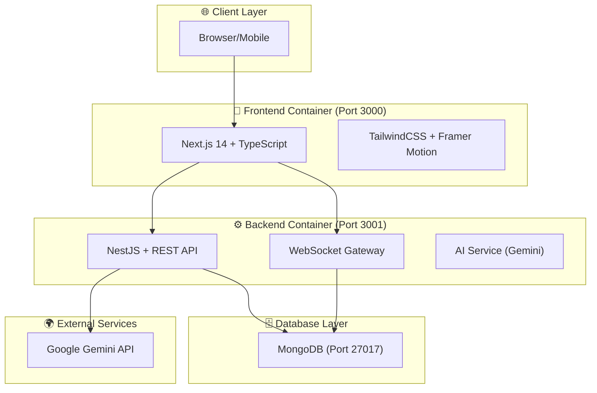

# Mystica - System Architecture

## Technology Stack

### Frontend
- **Framework**: Next.js 14 (App Router)
- **Language**: TypeScript
- **Styling**: TailwindCSS
- **Animations**: Framer Motion
- **Icons**: Lucide React
- **State Management**: React Context / Zustand
- **Data Fetching**: Axios / TanStack Query

### Backend
- **Framework**: NestJS
- **Language**: TypeScript
- **Authentication**: Passport.js + JWT
- **Real-time**: Socket.io
- **Database ODM**: Mongoose

### AI & Infrastructure
- **AI**: Google Gemini Pro (via `@google/generative-ai`)
- **Docker**: Docker & Docker Compose
- **Database**: MongoDB
